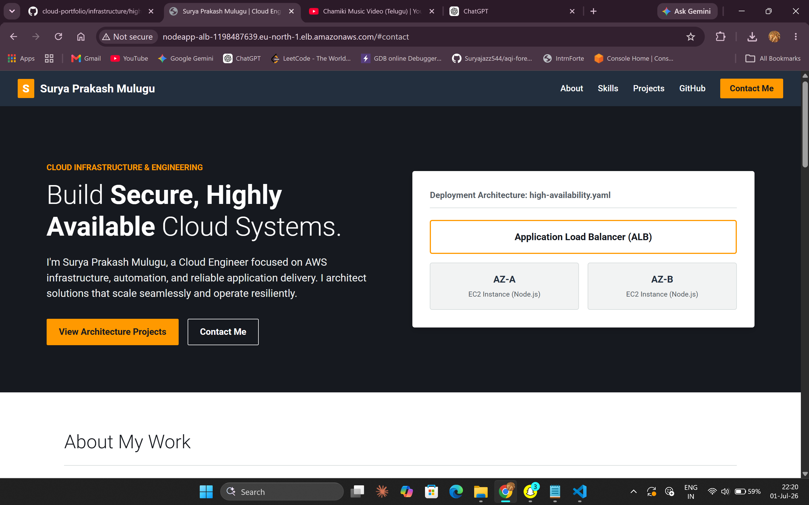
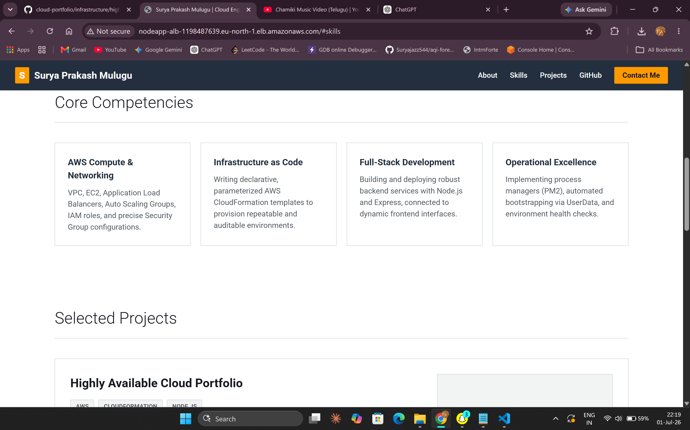
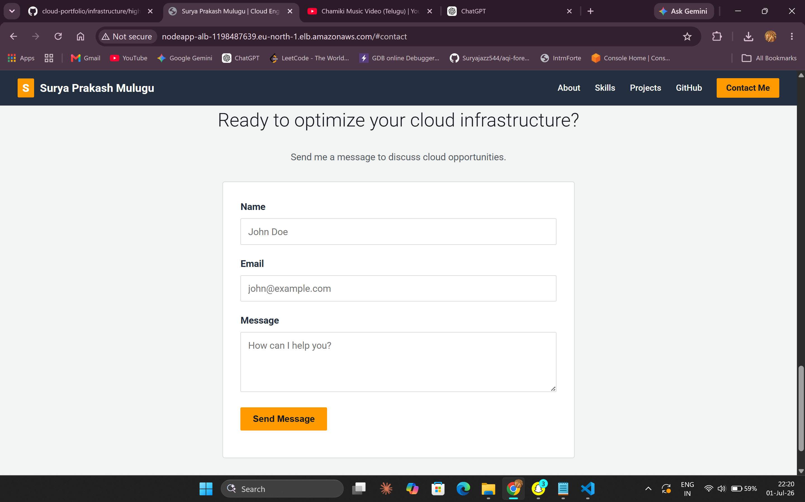

# Highly Available Cloud Portfolio 

A professional, full-stack Node.js portfolio deployed on a highly available AWS architecture using CloudFormation. 

This project demonstrates both **Cloud Engineering** (Infrastructure as Code, High Availability, Load Balancing, Auto Scaling) and **Full-Stack Development** (Express.js backend, dynamic frontend rendering).

## Architecture

The infrastructure is provisioned entirely using AWS CloudFormation (`infrastructure/high-availability.yaml`) and consists of:

- **VPC & Networking**: A custom VPC with two public subnets across two Availability Zones for high availability.
- **Application Load Balancer (ALB)**: Distributes incoming HTTP traffic across multiple instances and performs health checks.
- **Auto Scaling Group (ASG)**: Maintains application availability and automatically scales EC2 instances based on demand (between 2 and 4 instances).
- **Security Groups**: Granular network access controls for the ALB and EC2 instances.
- **Automated Bootstrap (UserData)**: EC2 instances automatically install Node.js, `pm2`, clone this repository, install dependencies, and start the application on boot.

## Project Structure

```
cloud-portfolio/
├── app/                      # The Full-Stack Node.js Application
│   ├── public/               # Frontend assets
│   │   ├── css/style.css     # UI Styling
│   │   ├── js/script.js      # Frontend logic (fetches data from API)
│   │   └── index.html        # Main HTML structure
│   ├── package.json          # Node.js dependencies
│   └── server.js             # Express.js backend server and API
├── infrastructure/           
│   └── high-availability.yaml # AWS CloudFormation template
├── screenshots/             # Portfolio screenshots for README
│   ├── portfolio-screenshot.png
│   ├── portfolio-1-screenshot.png
│   └── portfolio-2-screenshot.png
└── README.md
```

## How to Deploy on AWS

### 1. Push to your GitHub
Before deploying, push this code to your own public GitHub repository.

### 2. Update the CloudFormation Template (Optional)
The CloudFormation template defaults to your GitHub repository URL (`https://github.com/Suryajazz544/cloud-portfolio.git`). If you push this code to a different repository, you can update the `RepositoryUrl` parameter in `infrastructure/high-availability.yaml` before deploying.

### 3. Deploy via AWS Management Console
1. Navigate to the **CloudFormation** console in AWS.
2. Click **Create stack** (With new resources (standard)).
3. Select **Upload a template file** and choose `infrastructure/high-availability.yaml`.
4. Provide a Stack Name (e.g., `portfolio-stack`).
5. In the Parameters section, ensure the `RepositoryUrl` points to your GitHub repository.
6. Click **Next**, acknowledge the capabilities, and click **Submit**.
7. Wait for the stack creation to complete. Go to the **Outputs** tab to get the `LoadBalancerDNSName` (your live website URL).

## How to Run Locally (Development)

To test the application locally without AWS:

1. Navigate to the `app` directory:
   ```bash
   cd app
   ```
2. Install dependencies:
   ```bash
   npm install
   ```
3. Start the server:
   ```bash
   npm run dev
   ```
4. Open your browser and visit `http://localhost:3000`.

## Screenshot







## Features
- **Dynamic Frontend**: The projects section is loaded dynamically from the Express backend via REST API.
- **Resilient**: PM2 ensures the Node.js process restarts if it crashes, and ASG ensures EC2 instances are replaced if they fail.
- **Zero-downtime Deployments**: The Application Load Balancer seamlessly handles traffic while instances are provisioned.
